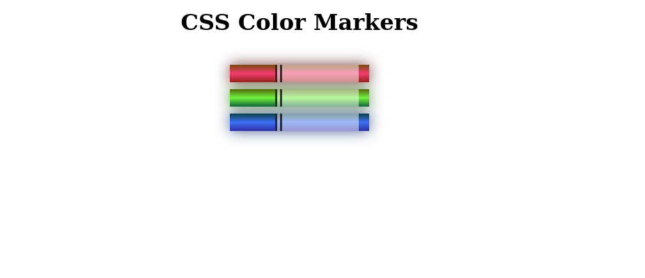

# Colored Markers

## Table of contents

- [Overview](#overview)
  - [Screenshot](#screenshot)
- [My process](#my-process)
  - [Built with](#built-with)
  - [What I learned](#what-i-learned)
  - [Continued development](#continued-development)
  - [Useful resources](#useful-resources)
- [Author](#author)

## Overview

### Screenshot

## My process

### Built with

- Semantic HTML5 markup
- CSS

### What I learned

This project was a good way to practice Semantic HTML5 and CSS concepts . And the third project i developed in this Responsive Web Design repository.

### Continued development

I want to keep using Semantic HTML skills and implement CSS concepts in my future projects, using good SEO and improving the overall look of the pages i develop.

### Useful resources

- [w3schools](https://www.w3schools.com/html/default.asp) - This helped me review the main functionalities of the HTML so i could build semantic pages. I really liked this pattern and will use it going forward.
- [w3schools](https://www.w3schools.com/css/) - This helped me review the CSS functionalities so i could build better looking pages. I hope to keep improving the style of my projects.

## Author
 
- Linkedin - [caio magalhães](https://www.linkedin.com/in/caio-magalhaes-dev/)
